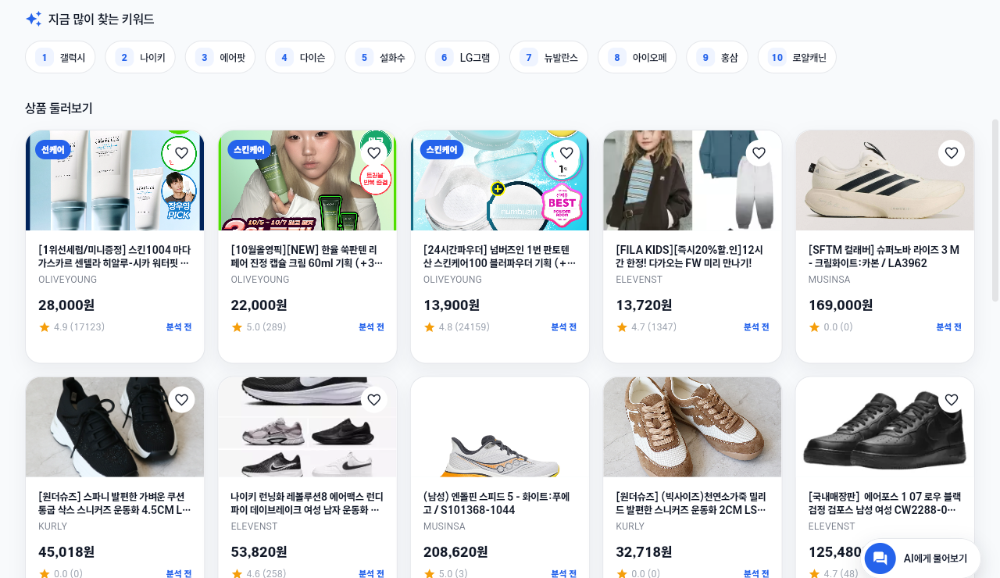
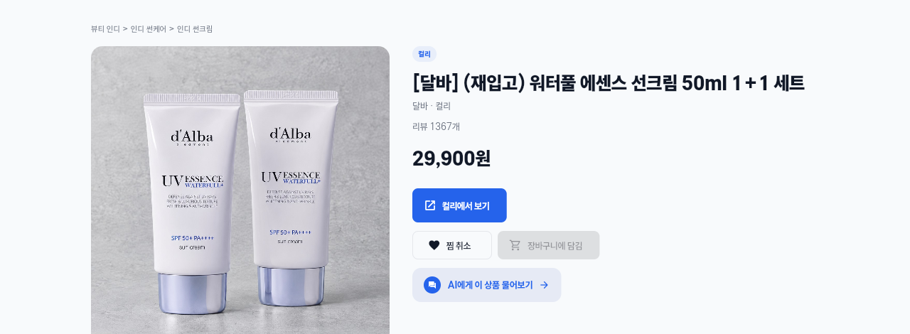
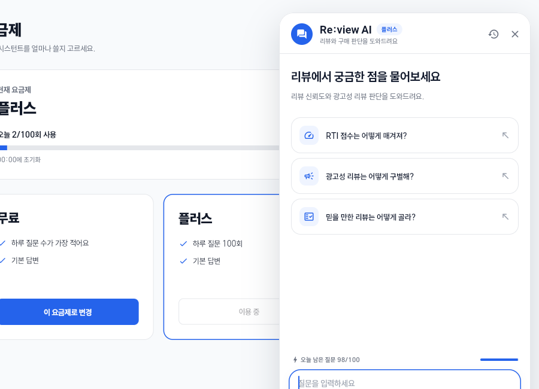

# Re:view

실사용 리뷰 기반 쇼핑 신뢰도 분석 서비스입니다. Flutter로 상품 검색, 리뷰 확인, 가격 비교, 찜·장바구니, 상품 문맥 채팅과 계정 관리를 제공합니다. 운영 웹: [re-view.kr](https://re-view.kr).

## 현재 화면

공통 헤더와 검색 상태를 유지하며 본문을 전환합니다. 계정 화면은 공통 메뉴 안에서 스크롤하며, 설정의 **움직임 줄이기**를 켜면 전환·카드·갤러리 효과와 반복 로딩 모션을 줄입니다. 모바일 웹에서는 헤더, 필터, 상품 카드와 채팅 패널이 화면 폭에 맞춰 배치됩니다.

| 홈: 실제 상품 목록 | 상품 v2 상세 | 계정·플랜 |
| --- | --- | --- |
|  |  |  |

위 이미지는 2026-10-06 검증 당시 화면입니다. 상품·가격·사용량은 서버 응답에 따라 달라집니다.

## 상품 탐색과 데이터 계약

- 홈 실제 상품 목록은 `GET /api/products`를 사용하며 최대 100건입니다. `GET /api/dashboard`의 추천·RTI 섹션은 아직 별도 서버 샘플 데이터 기준입니다. 실제 목록을 해당 추천과 같은 분석 결과로 간주하지 않습니다.
- `GET /api/products?keyword=...` 검색은 컬리·올리브영·무신사·11번가의 몰당 최대 10건, 총 최대 40건입니다. 서버는 몰을 번갈아 정렬하며 보통 1~2초가 걸립니다. 요청 중에는 로딩을 표시하고, 이전 검색 응답이 새 결과를 덮지 않도록 합니다.
- 목록의 `externalId`, `dataPlatform`, `dataProductId`를 상세 이동과 채팅까지 보존합니다. 라우트는 필드쌍을 우선 사용해 `/product/:platform/:productId`로 이동하고, 외부 식별자가 없는 기존 상품은 `/product/:id`를 사용합니다. `externalId`만 있으면 첫 `-`를 기준으로 분리하며 상품 ID 안의 `-`·공백·슬래시는 안전하게 인코딩합니다.
- 찜·장바구니 REST 요청에는 기존 숫자 상품 ID를 유지합니다. 상품 채팅에는 원본 `externalId`를 우선 전달하고, 필드쌍만 있으면 `{platform}-{productId}`를 생성합니다. 외부 정보 없는 상품의 숫자 ID는 외부 채팅 식별자로 보내지 않습니다.
- 카테고리는 서버 enum과 공식 표시명을 사용하고 `subCategory`는 몰 원문으로 별도 표시합니다. null 또는 해석할 수 없는 분류는 임의로 추정하거나 필터에서 잘못 제외하지 않고 안내와 함께 유지합니다.

### v2 상세와 분석 전 상태

v2 화면은 `GET /api/v2/products/:platform/:productId`를 조회합니다. `QUEUED`의 `product: null`과 수집 job을 유지하고 job을 3초 간격으로 확인합니다. 수집은 약 15초 걸릴 수 있으며, 30초 이후 지연 안내와 120초 제한·재시도를 제공합니다. 리뷰는 `nextCursor`로 더 불러오며 중복 리뷰와 반복·순환 cursor를 차단하고 실패 시 기존 내용을 보존합니다.

RTI·등급·색상이 null이면 **분석 전**입니다. 0점은 실제 0점으로 표시하며, 미분석을 안전 등급·초록색·가상의 분석 수치로 바꾸지 않습니다. RTI 평균은 미분석을 제외하고, 전부 미분석이면 분석 전으로 표시합니다. 미분석 상품은 양수 RTI 필터를 통과하지 않으며 정렬에서 뒤로 배치됩니다. 리뷰 수·평점의 null은 숨기고 명시적인 0은 표시합니다.

## 로그인·계정·채팅

Google/네이버 OAuth, 회원가입·비밀번호 재설정, 온보딩, 계정 설정, 찜·장바구니, 신고·피드백·알림 화면을 제공합니다. OAuth 시작 경로는 `/oauth2/authorization/{google,naver}`이고 서버 콜백은 `https://re-view.kr/login/oauth2/code/{google,naver}`입니다. 인증이 필요한 화면은 로그인 상태에 따라 이동을 제어합니다.

플랜은 `PATCH /api/users/me/plan`에 `{"planTier":"FREE"|"PLUS"|"PRO"}`를 보내 변경합니다. 반환된 사용자 플랜을 검증하고 `GET /api/users/me`와 `GET /api/chat/quota`를 다시 확인해 현재 화면과 열린 채팅의 권한·한도를 갱신합니다. 실패·불일치·재조회 실패를 성공으로 표시하지 않습니다. `GET /api/plans` 의존은 없으며 한도 수치는 서버 응답을 사용합니다. 결제는 구현 범위에 포함되지 않습니다.

채팅은 일반 `/api/chat/messages`와 프로 `/api/chat/pro/messages`를 사용합니다. 서버 quota에 따라 프로 선택과 전송을 제어하고, `CHAT_PLAN_REQUIRED`·`CHAT_QUOTA_EXCEEDED`에 맞는 안내와 상태 갱신을 제공합니다.

## 구성

Flutter/Dart, Riverpod, GoRouter, Dio 기반이며 기능별 data/domain/presentation 계층을 분리합니다. DTO는 수동 파싱하고 공통 `Result`·`Failure`로 오류를 전달합니다.

- `lib/app/`: 공통 shell, router, 반응형 배치, 테마·모션
- `lib/core/`: API 설정, 네트워크, 인증 저장소, 공통 provider
- `lib/features/`: 홈·검색·상세·external_product·채팅·플랜·계정·찜·장바구니·신고·관리자 등
- `lib/shared/`: 공통 위젯·상수·확장
- `test/`: 도메인·데이터·상태·위젯 회귀 검증

Android/iOS 프로젝트도 포함하지만 아래 실기 검증 결과는 웹 기준입니다. 이번 변경에서 네이티브 앱 배포를 검증하지 않았습니다.

## 로컬 실행과 검증

Actions는 Flutter **3.44.2**, Vercel Git의 `build.sh`는 Flutter가 없을 때 **3.44.0**을 설치합니다. Dart SDK 요구 조건은 `pubspec.yaml`의 `^3.11.4`입니다.

```bash
flutter pub get
flutter run -d chrome
```

로컬 웹과 네이티브 기본 API는 `https://api.re-view.kr`이며 배포 웹은 현재 origin을 사용합니다. 다른 API 환경은 공개 API 주소만 지정합니다.

```bash
flutter run -d chrome --dart-define=API_BASE_URL=https://api.re-view.kr
flutter analyze
flutter test
flutter build web --release
bash scripts/write-deployment-marker.sh
```

메모리가 작은 환경에서는 전체 테스트와 릴리스 빌드를 순차 실행합니다. 운영 API 연결은 실제 데이터를 변경할 수 있으므로 변경 QA에는 허용된 테스트 계정·상품을 사용하고 원래 상태를 복원합니다. 서버 간 인증용 토큰은 프론트 코드·웹 빌드·공개 환경 설정에 넣지 않습니다. 계정 정보와 민감 로그도 커밋하지 않습니다.

### 2026-10-06 검증 기준

실상품·플랜·헤더·포커스·모션 변경 기준 **375 tests 통과**, release web build 성공, analyze는 기존 관리자 info 3개만 남고 새 warning/error가 없습니다. 이는 당시 앱 코드의 검증 결과이며 문서 변경만을 위해 전체 검증을 반복하지 않습니다.

| 환경 | 확인 범위 |
| --- | --- |
| 단위·위젯/mock | 외부 식별자 필드쌍/externalId/기존 상품·큰 숫자 ID, null과 실제 0, QUEUED→완료, 리뷰 cursor, 플랜 응답 실패·불일치·열린 채팅 갱신, 한도/프로 오류, 최초 포커스, 움직임 줄이기 |
| 로컬 릴리스 웹 + 운영 API·기존 로그인 세션 | 실제 외부 상품 찜·장바구니 추가/취소와 원상복원, v2 이동·리뷰 페이징·상품 채팅, FREE→PLUS→FREE 및 열린 채팅 quota, 모바일 배치 |
| 운영 웹·기존 로그인 세션 | 홈→v2 상세, 선크림 검색 40건·분석 전, 상품 채팅 200, FREE→PLUS→FREE·서버 quota 갱신·복원, 모바일 플랜, 레이아웃/포커스 오류 없음 |

추가 운영 QA에서는 FREE 계정의 남은 질문 2회를 UI에서 각각 200으로 처리했습니다. 서버 remaining 0/usedToday 5 이후 한도 안내와 입력·전송 비활성화, 추가 UI 요청 차단을 확인했습니다. 운영 API는 일반 요청 `429 CHAT_QUOTA_EXCEEDED`, 프로 요청 `403 CHAT_PLAN_REQUIRED`를 반환했으며 거절 요청은 사용량을 증가시키지 않았습니다. FREE 플랜·기존 세션을 유지하고 사용량을 임의 복원하지 않았습니다.

소셜 재인증/OAuth 콜백과 신고·투표 실제 제출은 적절한 테스트 인증/제출 대상 미확보로 실계정 미검증입니다. 갤러리 전용 브라우저와 실제 PRO 허용 대화도 위 실계정 결과에 포함되지 않습니다. mock 검증을 실계정 완료로 간주하지 않습니다.

## 배포

`develop` 머지는 운영 배포를 발생시킵니다. 두 빌드 경로를 유지합니다.

| 경로 | 빌드·설정 |
| --- | --- |
| GitHub Actions `.github/workflows/vercel-deploy.yml` | develop PR은 preview, develop push는 production. `flutter build web --release` 후 SHA 표식을 작성하고 `build/web`을 Vercel에 배포. `web/vercel.json` 사용 |
| Vercel Git integration | 루트 `vercel.json`의 `bash build.sh` 실행. Flutter 설치/빌드·SHA 표식 후 `build/web`을 제공 |

양쪽 설정은 `/api`, OAuth 시작·콜백을 API 서버로 연결하고 SPA fallback을 제공합니다. 서버 CORS 제약으로 preview 도메인의 실제 로그인은 운영과 다를 수 있습니다.

Actions concurrency는 **동일 ref의 Actions 실행만** 직렬화합니다. 별도 Vercel Git 빌드와의 교차 순서는 보장하지 않습니다. 두 경로와 이전 실행이 모두 종료한 뒤 [운영 deployment.json](https://re-view.kr/deployment.json)의 `commitSha`를 최종 `origin/develop`과 대조합니다. 이 응답은 `Cache-Control: no-store`이며 커밋 SHA만 공개합니다.

## 남은 의존과 릴리스

- 실제 RTI 분석과 `GET /api/dashboard`의 실제 상품 전환은 서버 후속 작업입니다. 더미 33건 삭제는 v2 프론트 배포와 대시보드 전환 이후 서버가 진행합니다.
- 오늘의집·네이버·에이블리 검색은 수집기 문제로 현재 검색 계약에서 제외돼 있습니다.
- 결제, 디자인 리뉴얼, 다크 모드, 추가 수집기 구현은 이번 범위 밖입니다.
- v1.1.0은 README 최신화와 필요한 실계정 QA 완료 후 main 릴리스 PR·태그·릴리스 순서로 진행합니다. 검증 환경이 없는 항목은 제한으로 남기며 완료로 표시하지 않습니다.

관련 서버 계약: [플랜 #177](https://github.com/FireViewLab/review-backend/issues/177), [실상품 목록 #179](https://github.com/FireViewLab/review-backend/issues/179), [상세 보강 #181](https://github.com/FireViewLab/review-backend/issues/181). 프론트 반영: [#246](https://github.com/FireViewLab/review-frontend/pull/246), [#247](https://github.com/FireViewLab/review-frontend/pull/247).
